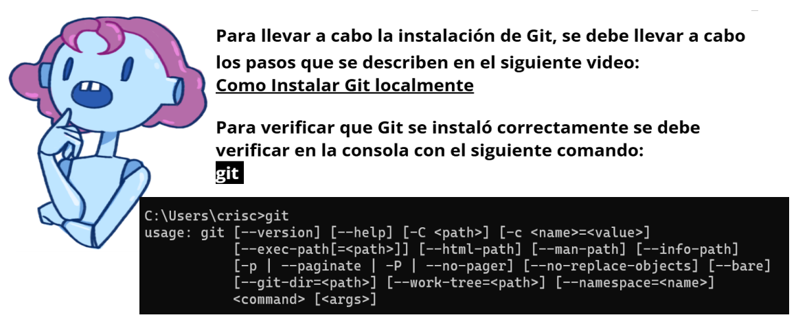
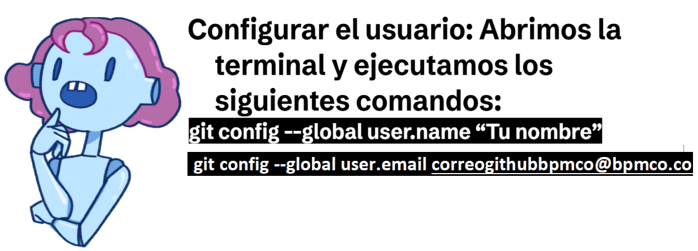
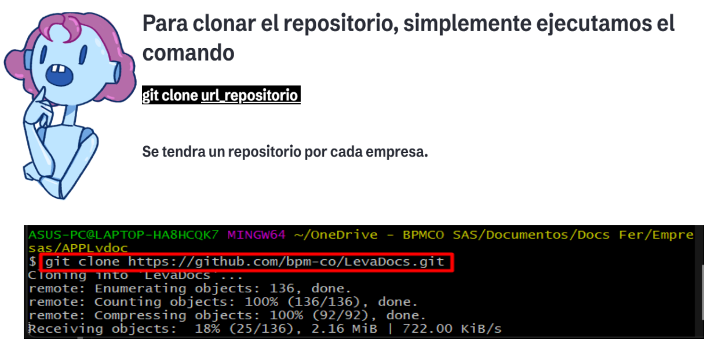

Guia rapida de lo que debemos saber antes de empezar con Git
<details>
<summary>

####  Primeros Pasos Con Git  
</summary>

<details>
<summary>

####  Instalar Git 
</summary>



  Al  colocar Git y tener respuesta nos indica que Git quedo instalado correctamente

</details>

<details>
<summary>

####  Configurar localmente nuestro usuario de Github

</summary>



   

``` jsx title=" Código Git"

 git config --global user.name "Tu nombre"
 git config --global user.email correogithubbpmco@bpmco.co


```

</details>


<details>
<summary>

####  Clonar el repositorio

</summary>



``` jsx title=" Código Git"
 git clone + URL

 Ejemplo:
 git clone https://github.com/bpm-co/LevaDocs.git
 


```

</details>


</details>

---

<details>
<summary>

####  Ramas y Flujos  

</summary>

</details>

---

<details>
<summary>

####  Nomenclaturas  

</summary>

<details>
<summary>

#### Gestión de Commits y Nombres de Ramas

</summary>

<details>
<summary>

#### HOTFIX 

</summary>

## Hotfix en Git

- Un **hotfix** es una actualización urgente realizada para solucionar un problema crítico en la versión de producción de un software.

### Flujo de Trabajo de un Hotfix

1. **Crear una Rama Hotfix**: Se crea una nueva rama a partir de la rama de producción (`main` o `master`).

<details>
<summary>

#### NOMBRE RAMA

</summary>


``` jsx title=" Nombre de la Rama"
 
 HOTFIX + NUMERO SOLICITUD + EMPRESA + TITULO_HISTORIA/TAREA

 Ejemplo:

 HOTFIX_1234_BPMCO_FalloModuloTareas


```
</details>

2. **Aplicar la Corrección**: Se implementa la corrección necesaria.
3. **Confirmar el Commit**: Se realiza un commit de la corrección.

<details>
<summary>

### Commit

</summary>


``` jsx title=" Commit"
 HOTFIX + NUMERO SOLICITUD + 'PEQUEÑA DESCRIPCION'

 Ejemplo:

 HOTFIX_1234_se realizo ajuste en el archivo p1


```

</details>


4. **Fusionar la Rama Hotfix**: La rama hotfix se fusiona de vuelta a la rama de producción y a la rama de desarrollo.
5. **Eliminar la Rama Hotfix**: La rama hotfix se elimina después de haber sido fusionada.


</details>

<!-- ---- -->

<details>
<summary>

#### FIX

</summary>

## Fix en Git

- Un **fix** Debe ser usado cuando el commit que soluciona un bug o problema en el código. A diferencia de un hotfix, que es una corrección urgente en producción, un fix es una corrección que puede no tener la misma urgencia pero que sigue siendo importante para la estabilidad y el correcto funcionamiento del software.


### Flujo de Trabajo de un Fix

1. **Crear una Rama para el Fix**: Se crea una nueva rama desde la rama de desarrollo (`develop`).

<details>
<summary>

#### NOMBRE RAMA

</summary>


``` jsx title=" Nombre de la Rama"
 
 FIX + NUMERO SOLICITUD + EMPRESA + TITULO_HISTORIA/TAREA

 Ejemplo:

 FIX_1234_BPMCO_FalloModuloTareas


```
</details>


2. **Aplicar la Corrección**: Se implementa la corrección necesaria.
3. **Confirmar el Commit**: Se realiza un commit de la corrección con un mensaje descriptivo.

<details>
<summary>

### Commit

</summary>


``` jsx title=" Commit"
 FIX + NUMERO SOLICITUD + 'PEQUEÑA DESCRIPCION'

 Ejemplo:

 FIX_1234_se realizo ajuste en el archivo p1


```

</details>

4. **Fusionar la Rama de Fix**: La rama de fix se fusiona de vuelta a la rama de desarrollo.
5. **Eliminar la Rama de Fix**: La rama de fix se elimina después de haber sido fusionada.


</details>

<!-- ---- -->

<details>
<summary>

#### FEAT

</summary>

## Feat en Git

Un **feat** (feature) es un commit que introduce una nueva característica o funcionalidad al código. Los commits de tipo `feat` se utilizan para agregar nuevas capacidades a una aplicación o proyecto.

### Flujo de Trabajo de un Feat

1. **Crear una Rama para la Característica**: Se crea una nueva rama desde la rama de desarrollo (`develop`).

<details>
<summary>

#### NOMBRE RAMA

</summary>


``` jsx title=" Nombre de la Rama"
 
 FEAT + NUMERO SOLICITUD + EMPRESA + TITULO_HISTORIA/TAREA

 Ejemplo:

 FEAT_1234_BPMCO_FalloModuloTareas


```
</details>

2. **Desarrollar la Característica**: Se implementa la nueva funcionalidad.
3. **Confirmar el Commit**: Se realiza un commit de la nueva característica con un mensaje descriptivo.

<details>
<summary>

### Commit

</summary>


``` jsx title=" Commit"
 FEAT + NUMERO SOLICITUD + 'PEQUEÑA DESCRIPCION'

 Ejemplo:

 FEAT_1234_se realizo ajuste en el archivo p1


```

</details>


4. **Fusionar la Rama de Feat**: La rama de feat se fusiona de vuelta a la rama de desarrollo.
5. **Eliminar la Rama de Feat**: La rama de feat se elimina después de haber sido fusionada.


</details>


</details>


</details>

---

<details>
<summary>

####  Buenas Practicas  

</summary>


</details>

---

<details>
<summary>

#### Estos son comandos comunes de Git que se usan en varias situaciones

</summary>


 **CLONE** :
 Clonar un repositorio en un nuevo directorio

 **INIT** : 
 Crear un repositorio Git vacío o reinicializar uno existente


 
 

</details>


## Ultima Actualización

<div class="ultima-actualizacion-seccion">
    <small>
        <i>
            Ultima actualización:
            <b> 25 de Junio del 2024.</b>
        </i>
    </small>
</div>
<div class="actualizado-por">
    <small>
        <i>
            Desarrollador:
            <b> Andrés M. Cifuentes</b>
        </i>
    </small>
    <small>
        <i>
            Autorizado por:
            <b class="pendiente"> Pendiente</b>
        </i>
    </small>
</div>
---


